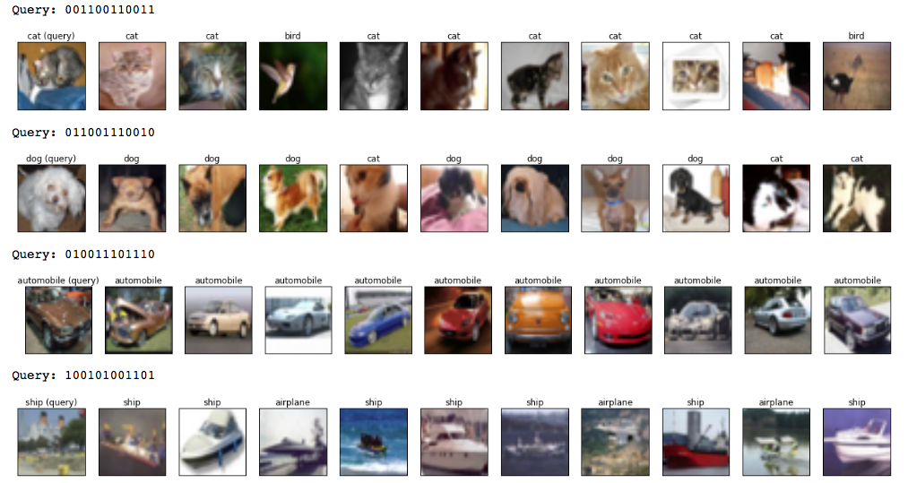

============
Chainer SSDH
============

This repository contains the experimental implementation of `Supervised Semantics-preserving Deep Hashing model <https://arxiv.org/abs/1507.00101>`_ using Chainer framework. This model can generate the semantics-preserving binary code from raw image, and it can be trained as simple classification task.

NOTE: This is not the official implementation.

Requirements
============

- Python
- Chainer
- Scipy
- Jupyter (For Demo)
- Matplotlib (For Demo)

Training
========

At first, please download the pre-trained model parameter of AlexNet. Download script is provided.

::

   $ bash scripts/download_alexnet.sh

Then, convert the caffemodel file to npz format to save the initialization time of training script.

::

   $ python scripts/convert_caffemodel_to_npz.py 

Now, let's start training of SSDH model. Length of output binary code can be specified by ``--units`` or ``-u`` option.

::

   $ python code/train.py -g 0 --out output/unit48 --units 48

Please check the all options by using ``--help`` option.

Demo
====

The sample notebook for similar image search is provided under the notebooks directory. Here is the sample output of image search using SSDH model.

